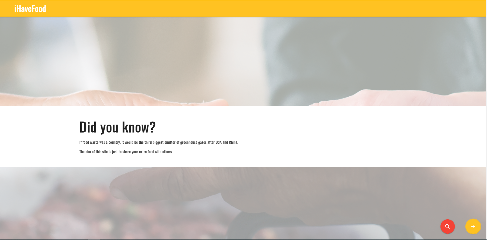
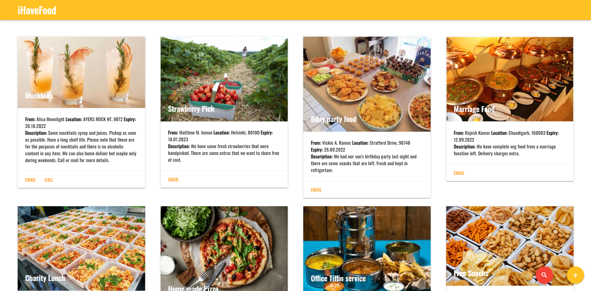
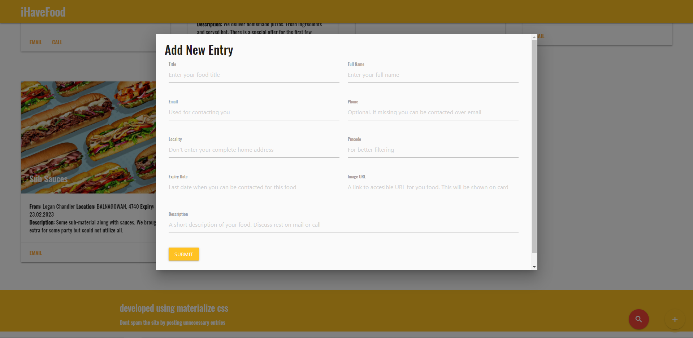
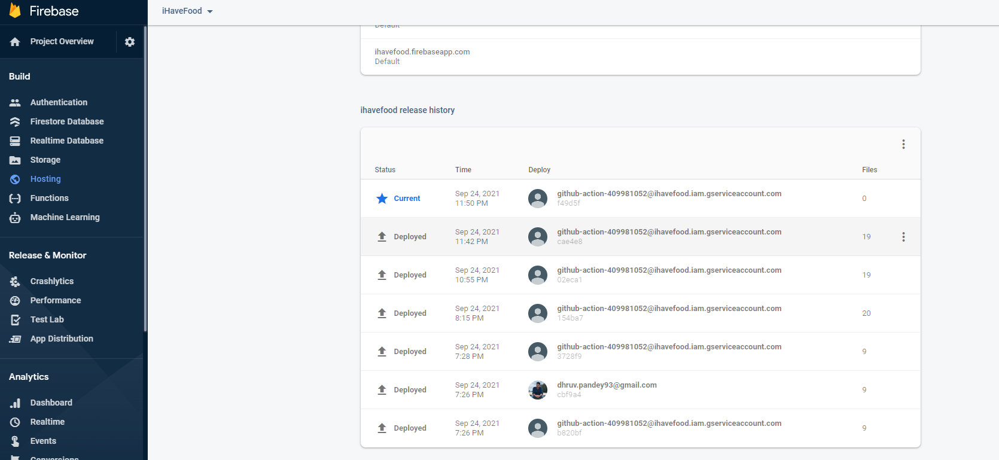
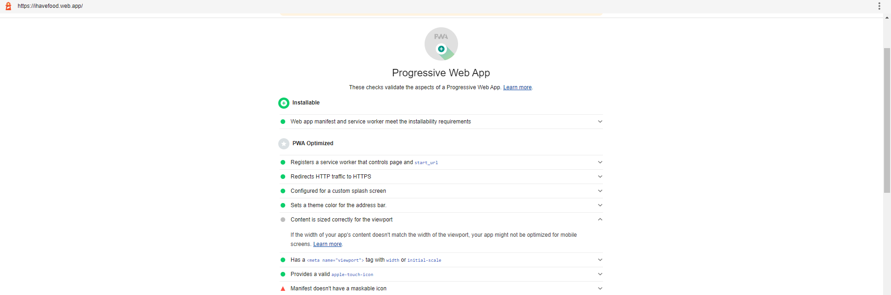
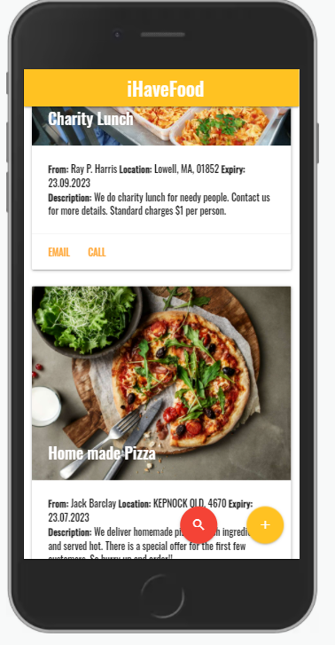
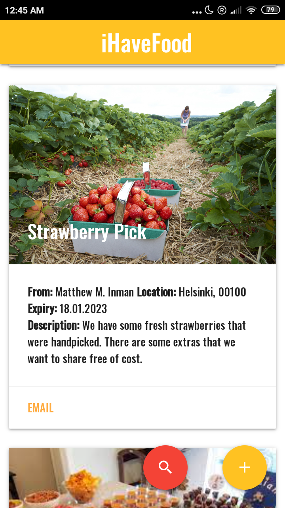

<h2>Website Component: Materialize Parallax</h2>

<h2>Website Component: Materialize cards</h2>

<h2>Website Component: Materialize Forms</h2>

<h2>Automated Firebase Deployments</h2>

<h2>Google Lighhouse PWA Audit results</h2>

<h2>On iPhone PWA</h2>

<h2>On Android PWA</h2>

(***This PWA is supporting offline mode)

Firebase Hosting Steps
==============================================
https://www.youtube.com/watch?v=e-aAAbY0miY&list=PL4cUxeGkcC9gTxqJBcDmoi5Q2pzDusSL7&index=29

URL of this PWA
==============================================
https://ihavefood.web.app/

Complete Playlist for PWA(Progressive Webapps)
======================================================
You cannot have PWA working using file://. So use Local Server
https://www.youtube.com/watch?v=4XT23X0Fjfk&list=PL4cUxeGkcC9gTxqJBcDmoi5Q2pzDusSL7&index=1
